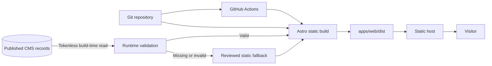

# Free-Tier Portfolio Website Architecture

<p align="center">
  <strong>Bring your story and assets. Let a coding assistant turn them into a verified portfolio—without paying for hosting.</strong>
</p>

<p align="center">
  <a href="https://astro.build/"></a>
  <a href="https://www.typescriptlang.org/"></a>
  <a href="https://tailwindcss.com/"></a>
  <a href="https://vite.dev/"></a>
  <a href="https://www.sanity.io/"></a>
  <a href="https://pages.cloudflare.com/"></a>
  <a href="https://nodejs.org/"></a>
  <a href="https://pnpm.io/"></a>
  <a href="https://github.com/Andhiksu/free-tier-portfolio-website/actions/workflows/ci.yml"></a>
  <a href="LICENSE"></a>
</p>

<p align="center">
  <a href="#ai-assisted-one-run-setup"><strong>Build with AI</strong></a> ·
  <a href="#run-it-locally"><strong>Run locally</strong></a> ·
  <a href="docs/ARCHITECTURE.md"><strong>Architecture</strong></a> ·
  <a href="docs/HOSTING_AND_UPGRADE_PATHS.md"><strong>Hosting options</strong></a>
</p>

I wanted this repository to be more useful than a finished portfolio screenshot. It is a practical
starting point you can copy, fill with your own story and media, and publish as a bilingual static
site on Cloudflare Pages. The default path works without a CMS account and is designed to stay
inside current free-tier limits for a normal personal portfolio.

If you use a coding assistant, start with the one-run workflow below. You prepare the things only you
can provide—your profile, public contact, projects, photos, and visual references—then the assistant
does the repetitive setup, validation, build, and deployment preparation. You still approve logins,
DNS, purchases, and publication. That keeps the workflow convenient without handing over sensitive
decisions.

> **No private history is hiding here.** This public repository starts from an anonymous reference
> baseline with fictional sample content. It is separate from the private historical portfolio that
> inspired the architecture.

## Jump to

- [What this project demonstrates](#what-you-can-learn-from-it)
- [AI-assisted one-run setup](#ai-assisted-one-run-setup)
- [Architecture](#architecture)
- [Run it locally](#run-it-locally)
- [Build and deployment model](#build-and-deployment-model)
- [Adapt it for your portfolio](#how-to-adapt-this-architecture)
- [Documentation](#documentation-and-historical-context)
- [Contributing](#contributing-to-the-case-study)

## Built with

<table aria-label="Technologies used by the portfolio starter">
  <tr>
    <td align="center"><a href="https://astro.build/" title="Astro — static frontend"><br /><sub><b>Astro</b></sub></a></td>
    <td align="center"><a href="https://www.typescriptlang.org/" title="TypeScript — typed source"><br /><sub><b>TypeScript</b></sub></a></td>
    <td align="center"><a href="https://tailwindcss.com/" title="Tailwind CSS — styling"><br /><sub><b>Tailwind CSS</b></sub></a></td>
    <td align="center"><a href="https://vite.dev/" title="Vite — build integration"><br /><sub><b>Vite</b></sub></a></td>
    <td align="center"><a href="https://www.sanity.io/" title="Sanity Studio — optional CMS"><br /><sub><b>Sanity Studio</b><br />optional</sub></a></td>
    <td align="center"><a href="https://pages.cloudflare.com/" title="Cloudflare Pages — recommended delivery"><br /><sub><b>Cloudflare Pages</b><br />recommended</sub></a></td>
  </tr>
</table>

Astro, TypeScript, Tailwind CSS, Vite, Node.js, and pnpm make up the local build. Cloudflare Pages is
the recommended free static host. Sanity Studio is an optional content layer—not a requirement for
the starter to work. If a logo does not load, its accessible alt text and linked label still identify
the technology.

## AI-assisted one-run setup

Here is the shortest path I designed for turning this reference into your own site:

```text
Use this template
      ↓
Fill starter-input/profile.json
      ↓
Add owned photos + project media + UI references
      ↓
Paste prompts/ONE_RUN_PORTFOLIO.md into a capable coding agent
      ↓
Review the local preview and pnpm verify evidence
      ↓
Approve Cloudflare login / domain / publication when ready
      ↓
Verify the live portfolio
```

It works with a coding workspace such as Codex, ChatGPT with repository tools, Claude Code, Gemini
CLI, GitHub Copilot coding agent, or another assistant that can edit files and run commands. It is
not tied to one AI provider.

**Start here:** read [`START_HERE_AI.md`](START_HERE_AI.md), prepare
[`starter-input/`](starter-input/), then use the canonical
[`ONE_RUN_PORTFOLIO.md`](prompts/ONE_RUN_PORTFOLIO.md) prompt. The agent will pause before anything
that needs your account, credential, payment, DNS change, or approval to publish.

## At a glance

| Area           | Historical implementation                                             |
| -------------- | --------------------------------------------------------------------- |
| Frontend       | Astro static output with strict TypeScript                            |
| Styling        | Tailwind CSS through Vite, plus repository CSS                        |
| Content        | Standalone Sanity Studio with typed schemas and validation            |
| Data boundary  | Published-only, draft-excluding, tokenless build reads                |
| Resilience     | Reviewed static content when CMS configuration or data is unavailable |
| Localization   | Paired English (`/en/`) and Indonesian (`/id/`) routes                |
| Delivery       | Cloudflare Pages serving `apps/web/dist`                              |
| Current status | Active public template and anonymous reference                        |

## What you can learn from it

- Ship a bilingual portfolio without a request-time application server.
- Put a typed validation boundary between a public CMS and rendered pages.
- Keep the site useful when CMS configuration, data, or network access is unavailable.
- Review privacy, evidence, localization, and publication without treating drafts as access control.
- Keep local and CI verification aligned through one reproducible command.

### Expected infrastructure cost

| Mode                  | Required services                                  | Expected starting cost           |
| --------------------- | -------------------------------------------------- | -------------------------------- |
| Local/static fallback | Git, Node.js, pnpm                                 | Free                             |
| Static public site    | Git host and static host with a suitable free tier | Often free within current quotas |
| CMS-backed site       | Static host plus your own Sanity project/dataset   | Often free within current quotas |
| Custom domain         | Registrar and optional DNS services                | Usually not free                 |

Provider plans and limits change. Confirm current pricing, quotas, and acceptable-use terms before
adopting any service; this repository demonstrates portability, not permanent provider pricing.

## Why this repository is public

I learned a lot from building the original architecture, and I wanted to turn those lessons into a
clean starting point that other people can actually use. This repository shows the trade-offs,
content-safety model, fallback strategy, and operational steps—not just the polished page at the end.

## What the build contains

The implementation includes paired English and Indonesian routes for the home page, Experience,
Projects, project details, Credentials, and the Media Library. The root route redirects to `/en/`.
Content is deliberately conservative: evidence-sensitive claims and media have review boundaries,
and the site can still render approved static fallback content when the CMS is absent or fails.

This is intentionally more complete than a landing-page starter. It includes the unglamorous parts
that usually matter later: content validation, bilingual route parity, safe failure, accessibility,
privacy-aware publication rules, CI, recovery notes, and a clear boundary between public source
code and provider credentials.

## Architecture



The frontend is static Astro output. The Sanity Studio was a separate editing application, not a
server runtime embedded in the website. The historical repository does not document a verified
automatic Sanity-publication-to-Cloudflare rebuild path, and it contains no implemented server-side
form processor, analytics integration, or CMS webhook.

See [`docs/ARCHITECTURE.md`](docs/ARCHITECTURE.md) for the component model, build lifecycle, trust
boundaries, and replaceable provider edges.

### Safety boundaries

- Production-style queries request the `published` perspective and exclude drafts.
- The Astro build reads unprefixed Sanity configuration only at build time; browser code does not
  receive a Sanity read token.
- CMS responses pass through runtime validation before they reach page adapters.
- Missing configuration, failed requests, and invalid records activate the static fallback.
- Public claims and media remain subject to source, privacy/redaction, localization, and publication
  review. An asset existing in a CMS is not, by itself, approval to publish it.

## Repository map

```text
apps/
├── web/              Astro website, routes, components, styles, tests, and static assets
└── studio/           Standalone Sanity schemas, structure, and Studio configuration
content-source/       Public-safe registers and publication evidence
docs/                 Governance, architecture, decisions, status, history, and runbooks
scripts/              Verification and content-support scripts
```

The provider adapters and historical deployment notes are kept for study only. They are not
instructions to recreate or modify the retired Cloudflare, Sanity, DNS, domain, or deployment
resources.

## Run it locally

### Prerequisites

- Git
- Node.js `24.18.0`, as pinned in [`.node-version`](.node-version)
- pnpm `11.11.0`, as declared in [`package.json`](package.json)

No AI-provider CLI or provider-specific tool is required.

### Fresh clone

```bash
git clone https://github.com/Andhiksu/free-tier-portfolio-website.git
cd free-tier-portfolio-website
pnpm install --frozen-lockfile
pnpm dev:web
```

Astro prints the local URL. With no Sanity build configuration, the web app intentionally uses its
static fallback content.

To run the standalone Studio during local study:

```bash
pnpm dev:studio
```

Copy [`.env.example`](.env.example) to an ignored local environment file only when you need to
inspect CMS-backed behavior. It contains names only, never credentials. The historical Sanity
resources have been removed, so a new adaptation must supply its own approved project and dataset.
Never put a draft/read token in a `PUBLIC_` variable or browser-delivered code.

### Useful commands

| Purpose               | Command                |
| --------------------- | ---------------------- |
| Web development       | `pnpm dev:web`         |
| Studio development    | `pnpm dev:studio`      |
| Format check          | `pnpm format:check`    |
| Lint                  | `pnpm lint`            |
| Type-check            | `pnpm type-check`      |
| Tests                 | `pnpm test`            |
| Schema validation     | `pnpm schema:validate` |
| Web build             | `pnpm build:web`       |
| Studio build          | `pnpm build:studio`    |
| Complete verification | `pnpm verify`          |

`pnpm verify` is the canonical local check. It runs whitespace, formatting, lint, type, test,
schema, and production-build checks. When identifiers are absent, the verification scripts use
non-production placeholders for Studio validation/build purposes; they do not mutate Sanity.

## Build and deployment model

### Package and build contract

| Concern         | Historical contract                                                      |
| --------------- | ------------------------------------------------------------------------ |
| Runtime         | Node.js `24.18.0`, pinned in [`.node-version`](.node-version)            |
| Package manager | pnpm `11.11.0`, declared in [`package.json`](package.json)               |
| Web build       | `pnpm build:web`                                                         |
| Static output   | `apps/web/dist/`                                                         |
| Public routes   | Paired `/en/` and `/id/` routes, with the root redirecting to `/en/`     |
| CMS boundary    | Build-time, published-only Sanity reads with no browser-delivered token  |
| Resilience      | Typed validation plus reviewed static fallback when CMS data is unusable |

`pnpm build` runs both the static web build and the standalone Studio build. A new host should
serve the web output only; the Studio is a separate editing application and is not part of the
static website directory.

### Historical delivery flow

The former delivery path was:

1. Approved content could be authored in the standalone Sanity Studio.
2. The Astro build read published CMS records at build time, validated them, and retained static
   fallback content when configuration or data was missing, invalid, or unavailable.
3. Astro generated the static website into `apps/web/dist/`.
4. Historical Cloudflare Pages delivery served that directory. The legacy Pages project, Sanity
   project, dataset, and custom-domain relationship were intentionally removed.

The repository does not claim a current deployment, release pipeline, live URL, automatic CMS
webhook, or automatic rebuild. Historical deployment notes describe the former build and are not
instructions to restore its provider resources.

## How to adapt this architecture

Use this repository as a starting point for your own site, not as a way to revive the retired
demonstration deployment. I designed the following parts to be replaceable:

> Start with the step-by-step [`docs/ADAPTATION_GUIDE.md`](docs/ADAPTATION_GUIDE.md), including its
> identity audit, static-only/CMS choice, portable host contract, and pre-launch checklist.

1. **Identity and routes** — Treat all included identity and portfolio content as historical sample
   data. Replace the profile copy, contact paths, locale content,
   metadata, canonical origin, and route inventory. Keep English/Indonesian parity only if your
   project needs it.
2. **Content contract** — Define your own Sanity schemas, dataset, publication rules, evidence
   register, and localized fields. Keep published-only queries, runtime validation, and a safe
   fallback if the site must remain useful without CMS data.
3. **Environment values** — Provide your own `SANITY_PROJECT_ID`, `SANITY_DATASET`, and
   `SANITY_API_VERSION` in ignored build/Studio configuration. Do not copy historical IDs, tokens,
   provider URLs, or account settings into a new project.
4. **Assets and claims** — Replace the reviewed example records and media with material you own or
   have permission to publish. Re-run source, ownership, privacy/redaction, alt text, credit, and
   publication review for every item.
5. **Delivery** — Choose and configure your own host. Set the new repository and branch, build
   command (`pnpm build:web`), output directory (`apps/web/dist`), domain, and rollback process.
   If using Cloudflare Pages, create and configure a new project; the retired Pages project is not
   a template resource and no longer exists.
6. **Operations** — Add only the integrations you can explain and verify end to end. This build did
   not establish an automatic CMS webhook or server-side runtime; do not assume either exists in an
   adaptation.

## Documentation and historical context

- [`docs/PROJECT_GUIDE.md`](docs/PROJECT_GUIDE.md) — stable architecture and contributor guide
- [`docs/ARCHITECTURE.md`](docs/ARCHITECTURE.md) — diagrams, trust boundaries, and component model
- [`docs/ADAPTATION_GUIDE.md`](docs/ADAPTATION_GUIDE.md) — fork-to-launch checklist for adopters
- [`docs/AI_ONE_RUN_SETUP.md`](docs/AI_ONE_RUN_SETUP.md) — provider-neutral coding-agent contract
- [`docs/HOSTING_AND_UPGRADE_PATHS.md`](docs/HOSTING_AND_UPGRADE_PATHS.md) — free baseline, domains,
  and optional paid upgrades
- [`docs/ENVIRONMENT_SETUP.md`](docs/ENVIRONMENT_SETUP.md) — local environment boundaries
- [`docs/DEPLOYMENT.md`](docs/DEPLOYMENT.md) — historical hosting contract and provider boundary
- [`docs/DISASTER_RECOVERY.md`](docs/DISASTER_RECOVERY.md) — recovery and rollback guidance
- [`docs/GOVERNANCE.md`](docs/GOVERNANCE.md) — privacy, publication, and owner gates
- [`docs/SANITIZATION.md`](docs/SANITIZATION.md) — placeholders and the public-data boundary
- [`docs/PROGRESS.md`](docs/PROGRESS.md) — current archival status and historical baseline
- [`docs/PHASE_LOG.md`](docs/PHASE_LOG.md) — chronological implementation evidence

Historical facts in these documents describe the former build at the time they were recorded.
They are not guarantees about current provider state or instructions to change the replacement
website.

## Contributing to the case study

The code is available under the [MIT License](LICENSE). Read [`CONTRIBUTING.md`](CONTRIBUTING.md)
before proposing a change and use [`SECURITY.md`](SECURITY.md) for private vulnerability reports.

1. Read [`AGENTS.md`](AGENTS.md), [`docs/GOVERNANCE.md`](docs/GOVERNANCE.md), and
   [`docs/PROJECT_GUIDE.md`](docs/PROJECT_GUIDE.md).
2. Confirm the branch, worktree, and scope before editing.
3. Keep changes focused and preserve the static, accessible fallback behavior.
4. Run `pnpm verify` before a local checkpoint.
5. Treat provider changes, publication, secrets, deployments, and destructive actions as separate
   owner-approved gates.

This starter demonstrates how a small portfolio can combine static rendering, a typed content
boundary, bilingual routes, and resilient fallbacks with open-source tools and free tiers where
applicable. Verify current provider pricing, quotas, and terms before launching your version.
