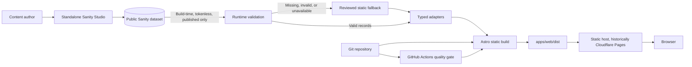
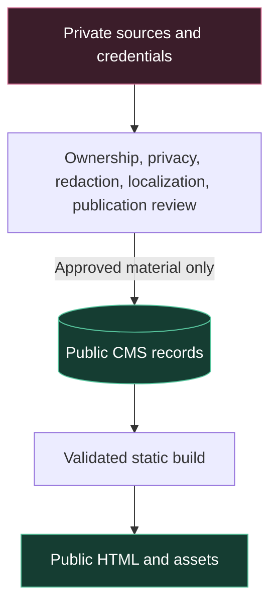

# Architecture Reference

## Purpose

This document explains the reusable architecture demonstrated by the archived portfolio. It does
not describe live infrastructure: the original Cloudflare Pages and Sanity resources were retired.

## System view

Sanity and Cloudflare are replaceable edges. The durable core is static generation, a typed content
boundary, safe fallback behavior, locale parity, and a host that can serve ordinary files.

## Trust boundaries

The repository's central security assumption is that anything in a public dataset or static output
can be discovered. Draft status, an obscure URL, or an unused asset is not access control.

## Components

| Component        | Responsibility                                                         | Replaceable?           |
| ---------------- | ---------------------------------------------------------------------- | ---------------------- |
| `apps/web`       | Static routes, rendering, localization, metadata, validation, fallback | Core example           |
| `apps/studio`    | Bounded content authoring schemas and editor structure                 | Yes                    |
| `content-source` | Public-safe provenance and publication records                         | Adapt to your workflow |
| GitHub Actions   | Frozen install and canonical `pnpm verify` gate                        | Yes                    |
| Sanity           | Historical structured-content provider                                 | Yes                    |
| Cloudflare Pages | Historical static delivery provider                                    | Yes                    |

## Request and build lifecycle

1. A contributor changes code or approved public-safe content.
2. The frozen dependency graph is installed and `pnpm verify` runs.
3. Astro optionally reads public published CMS records at build time without a browser token.
4. Records pass bounded validation and typed adapters; unusable CMS data falls back safely.
5. Astro emits static files to `apps/web/dist`.
6. Any static host can serve the output; no Node server is required at request time.

## Free-tier design choices

- Static output minimizes runtime compute, attack surface, and hosting cost.
- A separate Studio avoids shipping authoring code to visitors.
- Tokenless public reads eliminate a browser secret but require strict publication discipline.
- Static fallback keeps local development and public output useful when the CMS is absent.
- CI uses repository-native commands, so the project does not depend on a proprietary build tool.

Free-tier availability, quotas, bandwidth, build minutes, and commercial-use terms change. Verify
the current official provider documentation before creating infrastructure.
